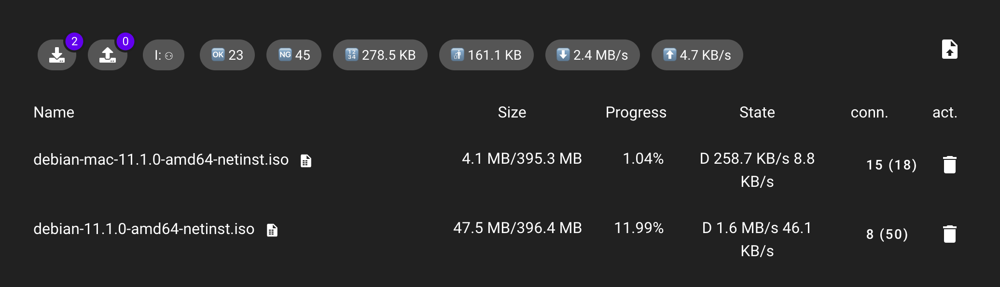

# kedge-svelte

A webui for Kedge.



## Features

* List all torrents
* Realtime sync stats of torrents
* Delelet a torrent (with data optional)
* Post a torrent file or a magnet link to add
* Show torrent Files and Peers

## TODO

* <del>Add support magnet link</del>
* Pause and resume a torrent task
* General configurability

## Developing

Once you've created a project and installed dependencies with `npm install` (or `pnpm install` or `yarn`), start a development server:

```bash
npm run dev

# or start the server and open the app in a new browser tab
npm run dev -- --open
```

## Building

Before creating a production version of your app, install an [adapter](https://kit.svelte.dev/docs#adapters) for your target environment. Then:

```bash
npm run build
```

> You can preview the built app with `npm run preview`, regardless of whether you installed an adapter. This should _not_ be used to serve your app in production.
